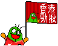
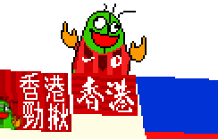
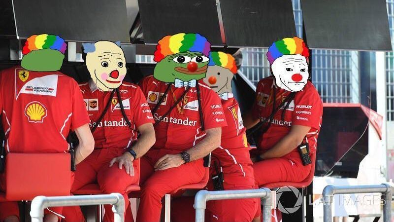

Hi there! I am Kai Ho John CHAN  

BEng (Hons) in Electronic and Information Engineering at The Hong Kong Polytechnic University

I watch football, F1 and anime in the free time, sometimes works on mini projects also.  

    
<b>Details on programming</b>

    

        I mainly use this 
        
    

    

        School project uses these language/hardware 
         
         
         
         
        
    

    

        Previous job uses these framework for frontend and backend 
         
         
         
         
         
         
    

 

    
<b>Happy corner for football</b>

    

        <h3>香港勁揪！We are Hong Kong!</h3> 
        
         
         
        Hong Kong vs Myanmar, at Hong Kong Stadium, 24/9/2022 First Half
         
        Hong Kong vs Myanmar, at Hong Kong Stadium, 24/9/2022 Second Half
    

 

    
<b>Happy corner for F1</b>

    

        I am going to join the Ferrari Race Engineer™ if they still act like this season... 
        
    

<!--
**kaihochan/kaihochan** is a ✨ _special_ ✨ repository because its `README.md` (this file) appears on your GitHub profile.

Here are some ideas to get you started:

- 🔭 I’m currently working on ...
- 🌱 I’m currently learning ...
- 👯 I’m looking to collaborate on ...
- 🤔 I’m looking for help with ...
- 💬 Ask me about ...
- 📫 How to reach me: ...
- 😄 Pronouns: ...
- ⚡ Fun fact: ...
-->
